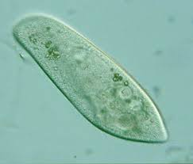
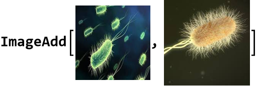

# markdown

внутри \`\` -> код, не рендерится

вход

    `код`

результат

`код`

после первого tab -> код

вход

    \tкод
результат

    код

## Заголовки

    # ## ### #### ##### ######

заголовки разных уровней

## шрифт

`*code*` -> *code*

`**code**` -> **code**

`_code_` -> _code_

`__code__` -> __code__

`Dcode` -> Dcode

`Dcode` -> Dcode

## Ссылка

`[текст](ссылка)`

`[шрифт](ссылка на шрифт)` -> [шрифт](#шрифт)

`[dkk](ссылка на dkk)` -> [dkk](https://t.me/dkkru)

## Таблица

    |колонка 1|колонка 2|
    |aliment 1|aliment 2|
    |ячейка a1|ячейка a2|

---

    |col1|col2|
    |:-|:-:|
    |a1|a2|

|column1|column2|
|:-|:-:|
|a1|a2|

## картинка

картинка всегда даётся по ссылке
либо в файловой системе:

`` -> 

`` -> 

я пользуюсь 2м вариантом потому что он по центру текста по высоте и больше похоже на wolfram

ссылка на картинку может быть внешняя:

`` -> 

## список

    - a
    - b
        - c
    - d

- a
- b
    - c
- d

## Пример 1

### Wolfram

### code

    [ImageAdd](#пример-1)[`, ``]`

### render

[ImageAdd](#пример-1)`[``, ``]`

### explanation

    [ImageAdd](#пример-1) -> ссылка на пример

    `[`, `, `,`]` -> промежутки кода выделены для красоты

     -> рендер картинки

## Пример 2

### Wolfram

### code

    |функция|описание|
    |:-|:-|
    |[ImageAdd](https://reference.wolfram.com/language/ref/ImageAdd.html?q=ImageAdd)[*image*, *x*]|[добавление](#добавление-указанной-величины-к-каждому-значению-канала) *x* к значению каждого канала *image*|
    |[ImageAdd](https://reference.wolfram.com/language/ref/ImageAdd.html?q=ImageAdd)[*image1*, *image2*]|[сумма](#ex1-101) изображений так, чтобы каждый пиксель полученного изображения являлся соответственно суммой пикселей *image1* и *image2*|
    |[ImageAdd](https://reference.wolfram.com/language/ref/ImageAdd.html?q=ImageAdd)[*image*, *expr1*, *expr2*, ...]|[добавление](#сложение-нескольких-изображений) каждого *expri* к *image*; *expri* может быть изображением, числом или цветом|

### render

|функция|описание|
|:-|:-|
|[ImageAdd](https://reference.wolfram.com/language/ref/ImageAdd.html?q=ImageAdd)[*image*, *x*]|[добавление](#добавление-указанной-величины-к-каждому-значению-канала) *x* к значению каждого канала *image*|
|[ImageAdd](https://reference.wolfram.com/language/ref/ImageAdd.html?q=ImageAdd)[*image1*, *image2*]|[сумма](#ex1-101) изображений так, чтобы каждый пиксель полученного изображения являлся соответственно суммой пикселей *image1* и *image2*|
|[ImageAdd](https://reference.wolfram.com/language/ref/ImageAdd.html?q=ImageAdd)[*image*, *expr1*, *expr2*, ...]|[добавление](#сложение-нескольких-изображений) каждого *expri* к *image*; *expri* может быть изображением, числом или цветом|

### explanation

#### таблица с уклонением влево:

    |функция|описание|
    |:-|:-|
    |a|b|

|функция|описание|
|:-|:-|
|a|b|

#### [Команда](ссылка на документацию)

    [ImageAdd](https://reference.wolfram.com/language/ref/ImageAdd.html?q=ImageAdd)

[ImageAdd](https://reference.wolfram.com/language/ref/ImageAdd.html?q=ImageAdd)

#### аргументы курсивом и индексом

    [*image1*, *image2*]

#### описание с ссылкой на заголовок в тексте (одна # + заголовок без пробелов) и оформлением текста

[добавление](#добавление-указанной-величины-к-каждому-значению-канала) *x* к значению каждого канала *image*

#### всё вместе в таблице

    |функция|описание|
    |:-|:-|
    |[ImageAdd](https://reference.wolfram.com/language/ref/ImageAdd.html?q=ImageAdd)[*image*, *x*]|[добавление](#добавление-указанной-величины-к-каждому-значению-канала) *x* к значению каждого канала *image*|
    |[ImageAdd](https://reference.wolfram.com/language/ref/ImageAdd.html?q=ImageAdd)[*image1*, *image2*]|[сумма](#ex1-101) изображений так, чтобы каждый пиксель полученного изображения являлся соответственно суммой пикселей *image1* и *image2*|
    |[ImageAdd](https://reference.wolfram.com/language/ref/ImageAdd.html?q=ImageAdd)[*image*, *expr1*, *expr2*, ...]|[добавление](#сложение-нескольких-изображений) каждого *expri* к *image*; *expri* может быть изображением, числом или цветом|
